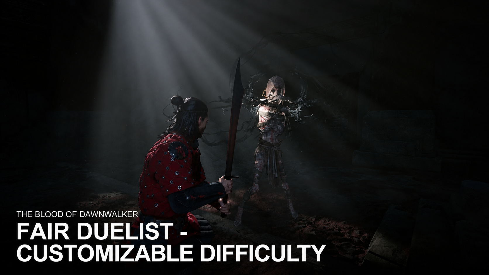

# Fair Duelist - Customizable Difficulty

Modifies the existing Duelist preset in The Blood of Dawnwalker.
Select Fair Duelist in the game's difficulty settings. This is the renamed Duelist slot, not a fifth preset.

[Download the Vortex archive](https://github.com/my-mods/Fair-Duelist-Customizable-Difficulty/raw/refs/heads/main/Fair-Duelist-Customizable-Difficulty.zip)

Enemy health: 75% of Fair (25% less health).
Enemy damage: Fair (100%, reduced from Duelist 160%).
Player combat stamina costs: Fair (100%, reduced from Duelist 175%).
Enemy attack pressure: configurable relative to the chosen reference; defaults to Duelist. Animation speed, parry timing and directional indicators remain controlled by the game.

Customization: keep RPG Difficulty on Fair Duelist to retain your INI balance (defaults: enemy health 75%, damage 100%, and combat stamina costs 100%). Changing Action Difficulty changes attack speed, aggression and parry timing, but does not change the RPG values. Indicators, consumables and other custom options can be changed independently. The overall preset may display Custom; that alone does not remove the RPG changes. Selecting another RPG difficulty or overall preset changes the balance accordingly. For the exact intended setup, keep Action Difficulty on Fair Duelist and directional indicators off.
Other presets and player maximum health are unchanged.

Installation: import Fair-Duelist-Customizable-Difficulty.zip into Vortex, choose the game-root installer if prompted, enable and deploy. Restart the game and select Fair Duelist.
Requirements: The Blood of Dawnwalker; Vortex with its Dawnwalker extension. UE4SS is required for INI overrides; the packaged default preset can run without it.
Update: replace the same Vortex mod entry with the new archive and deploy.
Uninstall: disable/remove this mod in Vortex and deploy; restart the game.
Conflicts: replaces /Game/_Dawnwalker/Combat/DA_DifficultyConfig, /Game/_Dawnwalker/Combat/StringTables/ST_Difficulties, and /Game/_Dawnwalker/System/Settings/ST_Settings_Tab_Game. Text mods replacing these string tables may conflict. Use only one mod replacing each of these assets; Fair Duelist - Customizable Difficulty must win for these values to apply. Archive filenames alone cannot detect this conflict.
Compatibility: built for the PC version; conflicts are listed above.

Original difficulty data belongs to Rebel Wolves and its respective rights holders. This mod changes three difficulty multipliers and the corresponding menu text.

## Settings

Use [Mod Setting Menu 1.0.5 or later](https://www.nexusmods.com/thebloodofdawnwalker/mods/271) from the main menu. Press Apply, then fully restart the game. See [SETTINGS.md](SETTINGS.md) for all controls, first-use import and preference backups. Console settings commands are retired.
